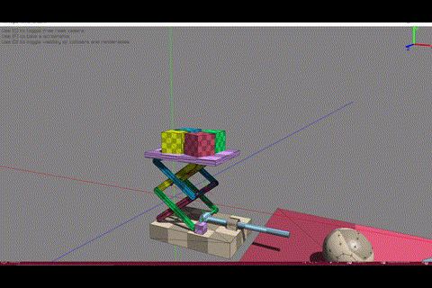
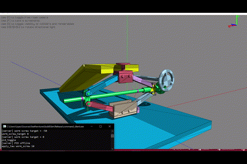
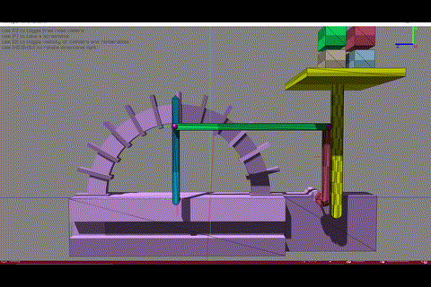
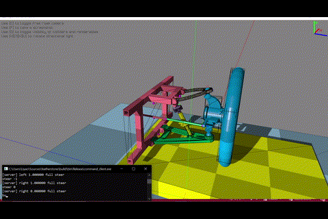
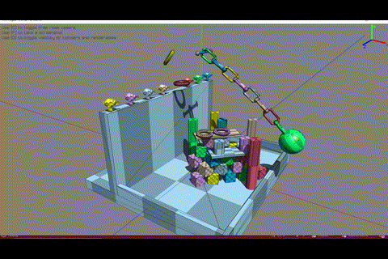
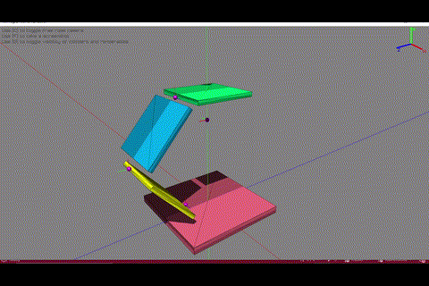
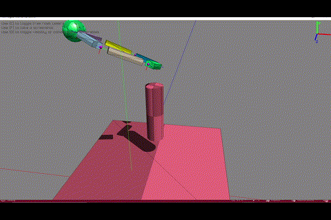

# Featherstone Articulated Body Physics Engine

A C++ articulated body physics engine for interactive demos and experiments.

## Features

### Featherstone-based forward dynamics
Implements RNEA (Recursive Newton–Euler Algorithm) and CRBA (Composite Rigid Body Algorithm), as described in [Rigid Body Dynamics Algorithms](https://link.springer.com/book/10.1007/978-1-4899-7560-7) by Featherstone, at the core of the solver.

### Closed-loop constraint support
Supports closed-loop systems using simple joints as loop-closure constraints. Loop closure is enforced at the acceleration level, with Baumgarte-stabilized velocity and position terms.

### Joint and DoF coupling
Supports coupling across joints and degrees of freedom by modeling coupling as linear constraints between DoFs. Constraints are resolved by parameterizing joint accelerations using the orthogonal complement basis of the constraint matrix.

### Impulse-based contact resolution
Solves contacts using an impulse-based approach, implementing Projected Gauss–Seidel (PGS) with Sequential Impulses (SI) and impulse warm starting. Impulses transmitted across loop-closure joints are also accounted for during collision handling.

### Springs
Solves spring forces using a semi-implicit Euler integration scheme, improving numerical stability and preventing blow-up for stiff springs.

### glTF-based physics asset pipeline
Streamlines physics asset creation and the simulation pipeline by supporting construction of a physics world from glTF physics assets exported from Blender.


## Supported Joints

| Joint Type | Dynamics Model | Support Loop Closure | Support Spring |
|----|---|---|---|
| Revolute | Motion subspace | ✅ | ✅ |
| Prismatic | Motion subspace | ✅ | ✅ |
| Cylindrical | Motion subspace | ✅ | ✅ *both DoFs |
| Spherical | Motion subspace | ✅ | ❌ |
| Gear | Coupling 2 revolutes | ❌ | ✅ *both  joints |
| Rack and Pinion | Coupling a revolute and a prismatic | ❌ | ✅ *both joints |
| Screw | Coupling the 2 DoFs of a cylindrical | ❌ | ✅ *both DoFs |
| Worm | Coupling linear DoF of a cylindrical and a revolute | ❌ | ✅ *all DoFs and joints |

- A spring cannot be applied to a joint when the joint is a loop closure.

## Demos

[YouTube link](https://youtu.be/xugRWBTrx6c)

What each of these demos demonstrates
| Name | Demo | Articulated | Loop Closure | Spring | Coupling | Spherical Joint | Trivial PID Control |
|---|---|---|---|---|---|---|---|
| Scissor Lift |  | ✅ | ✅ | ❌ | ❌ | ❌ | ❌ |
| Worm Screw Jack |   | ✅ | ✅ | ❌ | ✅*heavy | ❌ | ✅ |
| Spring Scale |  | ✅ | ❌ | ✅*stiff | ✅ | ❌ | ❌ |
| Double Wishbone Suspension |  | ✅ | ✅ | ✅ | ❌ | ✅ | ✅ |
| Collision and Scene Test |  | ❌ | ❌ | ❌ | ❌ | ❌ | ❌ |
| Spring Test |  | ✅ | ✅ | ✅*stiff | ❌ | ❌ | ❌ |
| Spherical Joint Test |  | ✅ | ✅ | ❌ | ❌ | ✅ | ❌ |

## Dependencies

- BulletCollision, [Bullet v3.25](https://github.com/bulletphysics/bullet3/tree/3.25)  
  Only the collision detection components are used. Collision resolution is implemented separately within this project.  
  Refer to `third_party/bullet` for build instructions.

- [nlohmann/json v3.12.0](https://github.com/nlohmann/json/tree/v3.12.0)

- [raylib v5.5](https://github.com/raysan5/raylib/tree/5.5)

- [tinygltf v2.9.5](https://github.com/syoyo/tinygltf/tree/v2.9.5)

- [Eigen v3.4.0](https://libeigen.gitlab.io/)  
  Used for core Featherstone dynamics.

- [glm v1.0.1](https://github.com/g-truc/glm/tree/1.0.1)  
  Used alongside raylib for rendering utilities.

## Build

### Required CMake Parameters

The following CMake cache variables must be specified if the libraries are not installed system-wide:

- `EIGEN3_INCLUDE_DIR` — Path to the Eigen include directory  
- `GLM_INCLUDE_DIR` — Path to the GLM include directory  

### Example (Windows – Visual Studio 2022)

```
cmake -DEIGEN3_INCLUDE_DIR=[your Eigen directory] -DGLM_INCLUDE_DIR=[your GLM directory]  .. -G "Visual Studio 17 2022"
```

### Tested On
- Windows 10 / Visual Studio 2022

## Next Steps

- Expand joint types (e.g., fixed joints, 6-DoF joints)
- Inverse dynamics and inverse kinematics for more sophisticated control
- Contact block solver for improved convergence and performance
- Coulomb friction formulated as a linear complementarity problem (LCP)
- Joint limits with impulse-based enforcement
- Rotational friction models at contact points
- CCD (Continuous Collision Detection)
